# Process speech by using Azure AI Speech

## Implement text-to-speech

Prosody -> speech and intonation in human-like language.

**Customizable AI (neural) voices.**

Non-neural voices will be retired in 2024.

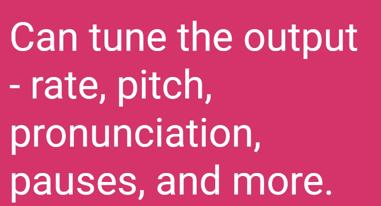

The speech API can run On-Prem!

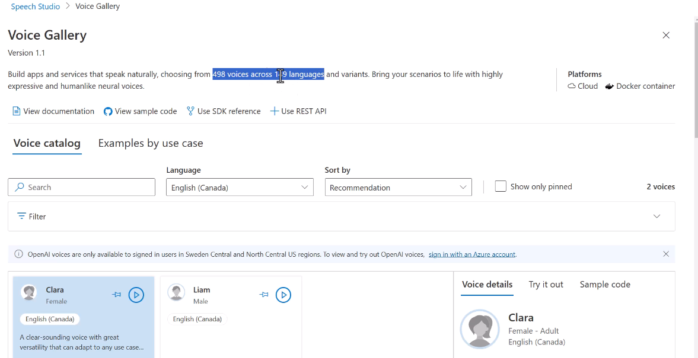

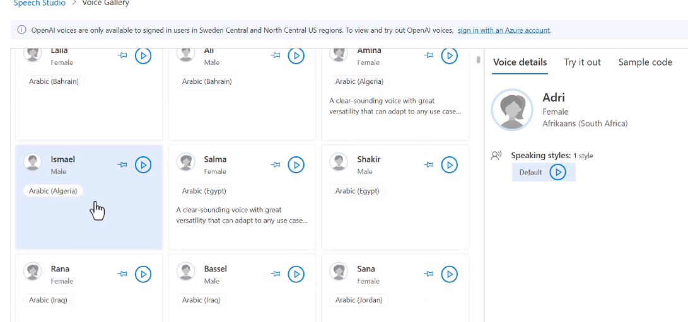

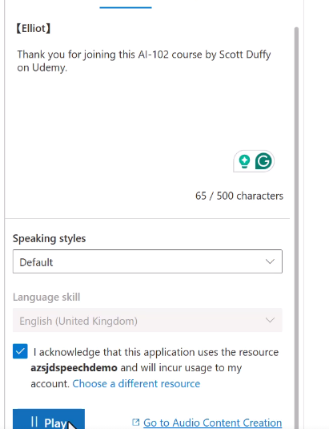

## Implement speech-to-text

Common for subtitles, transcrisps...

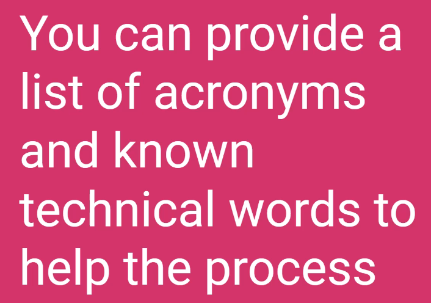

For example Azure, AI-102, .NET, etc... Technical-specific language.

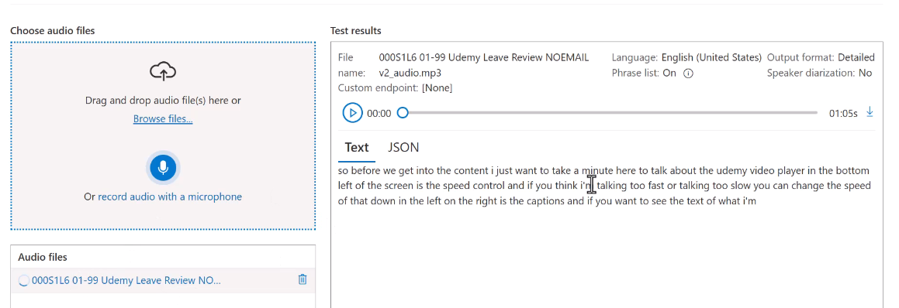

## Speech Synthesis Markup Language (SSML)

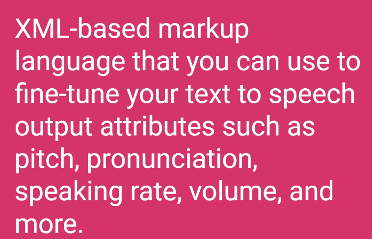

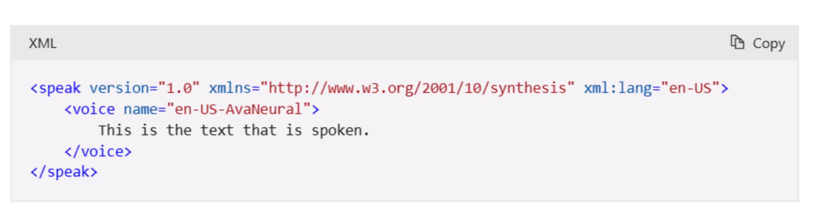

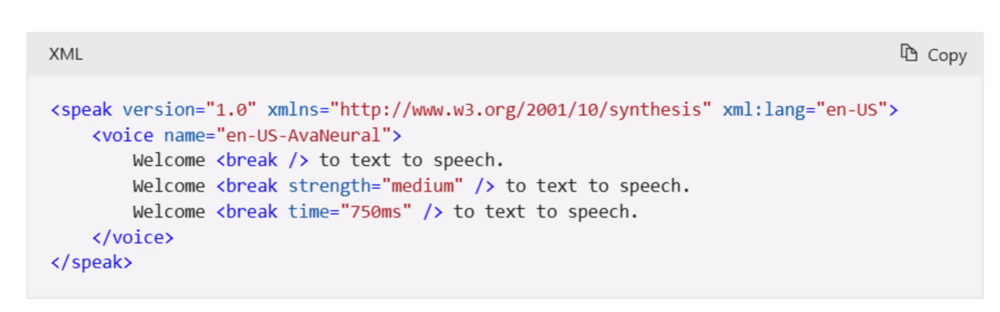

We have tons of options:

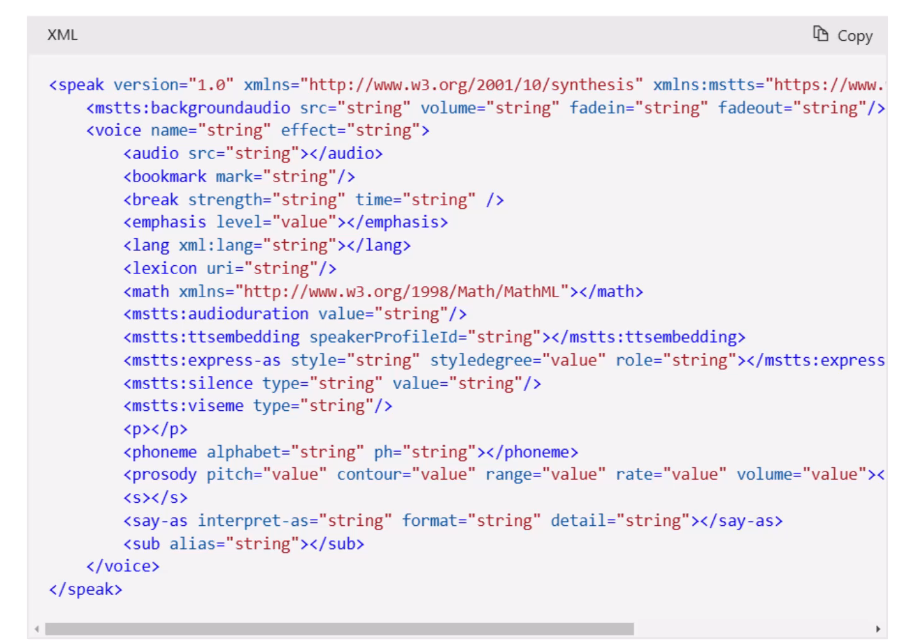

Also styles (jobs, emotions, etc...):

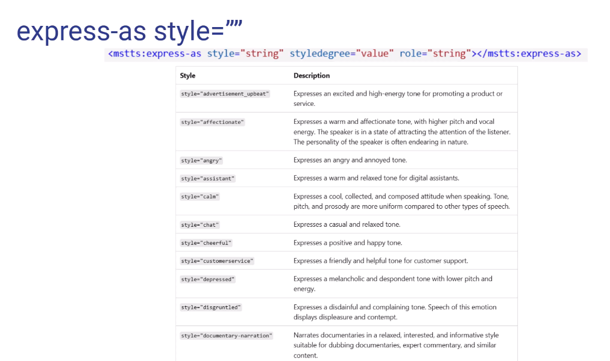

Angry/softness:

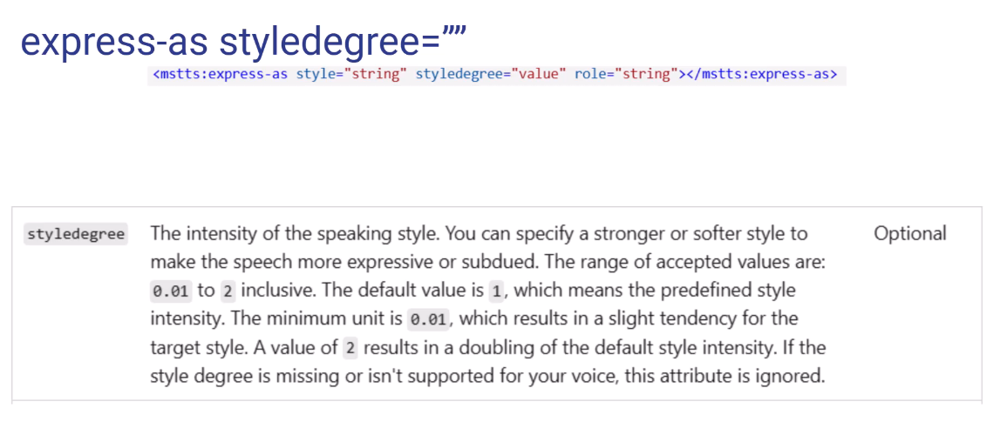

Also a role (age):

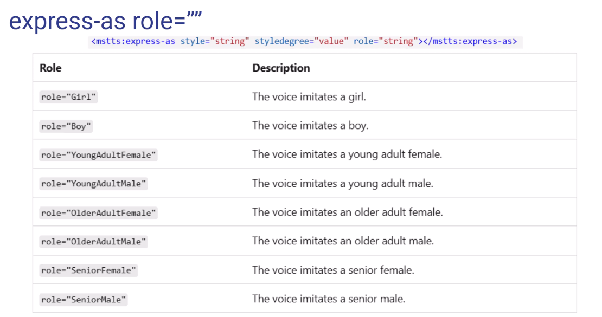

Clues on the shape of mouth. Useful for 2D/3D avatars!

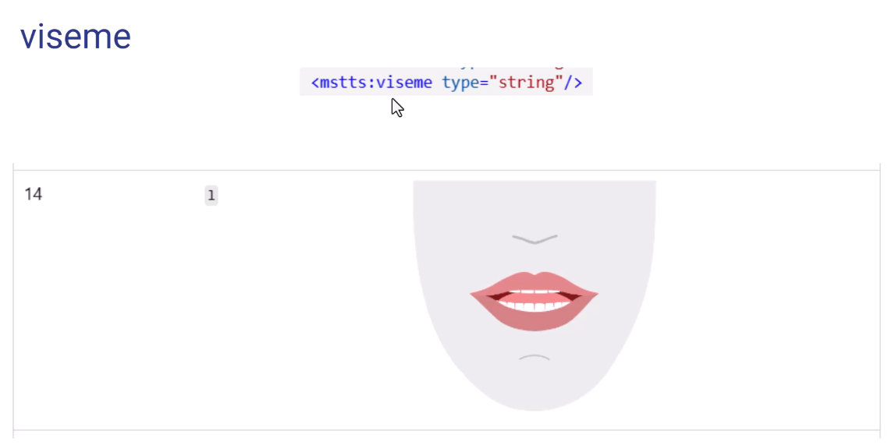

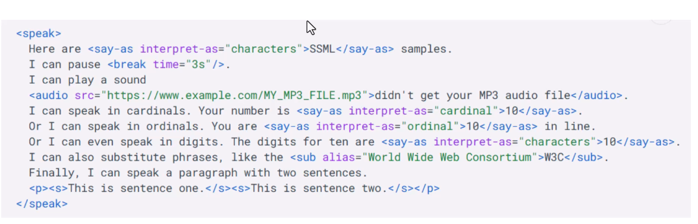

## Implement intent recognition

Intent is something the user wants to do.

## Implement keyword recognition

