# Process speech by using Azure AI Speech

## Implement text-to-speech

Prosody -> speech and intonation in human-like language.

**Customizable AI (neural) voices.**

Non-neural voices will be retired in 2024.

The speech API can run On-Prem!

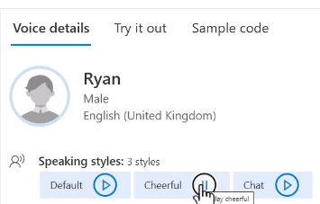

## Implement speech-to-text

Common for subtitles, transcrisps...

For example Azure, AI-102, .NET, etc... Technical-specific language.

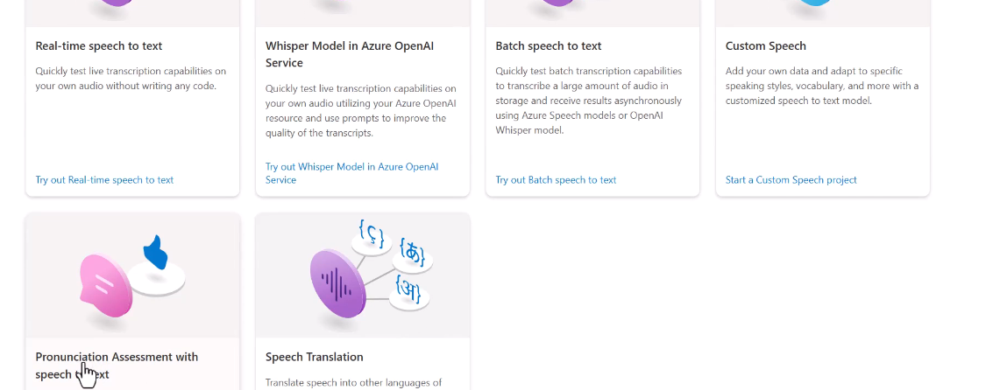

## Speech Synthesis Markup Language (SSML)

We have tons of options:

Also styles (jobs, emotions, etc...):

Angry/softness:

Also a role (age):

Clues on the shape of mouth. Useful for 2D/3D avatars!

## Implement intent recognition

Intent is something the user wants to do.

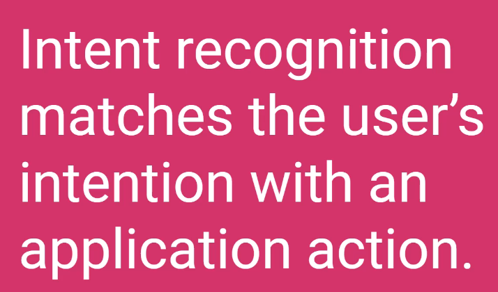

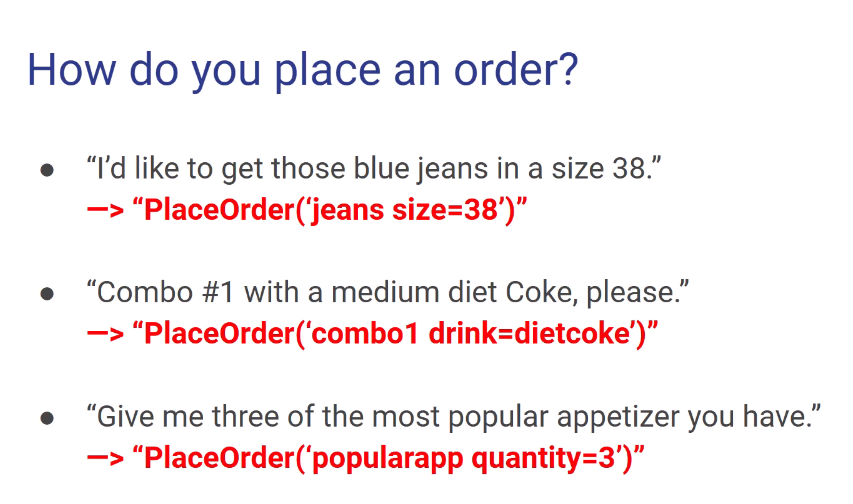

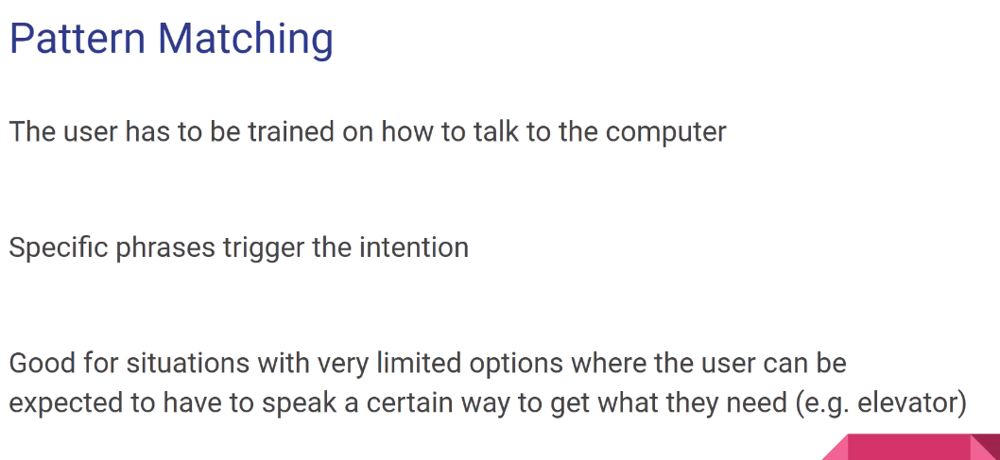

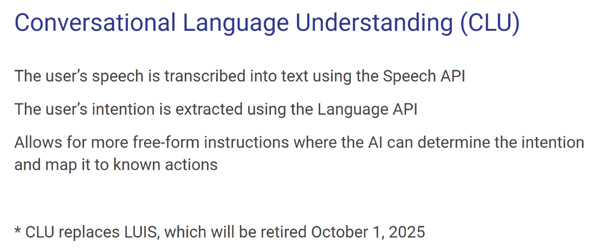

Two ways:

- Pattern matching. Recognize certain words and trigger the intention. Recommended for first and simple uses.
- Conversational Language Understanding (CLU). The user speech is transcribed and then the intention is extracted with the Language API.

About CLU:

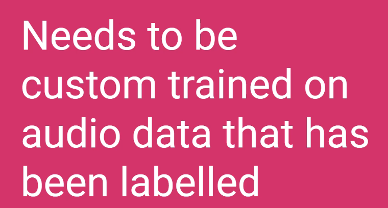

150+ examples needed.

## Implement keyword recognition

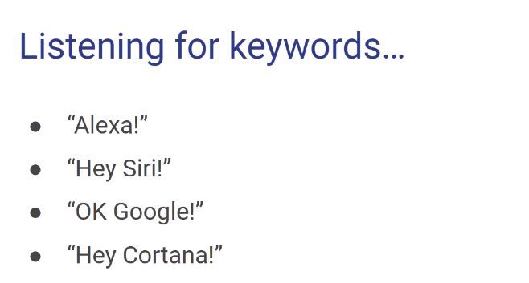

**Keyword recognition on-device!**

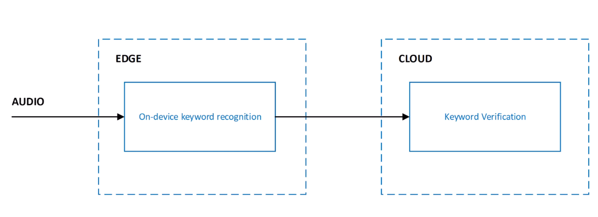

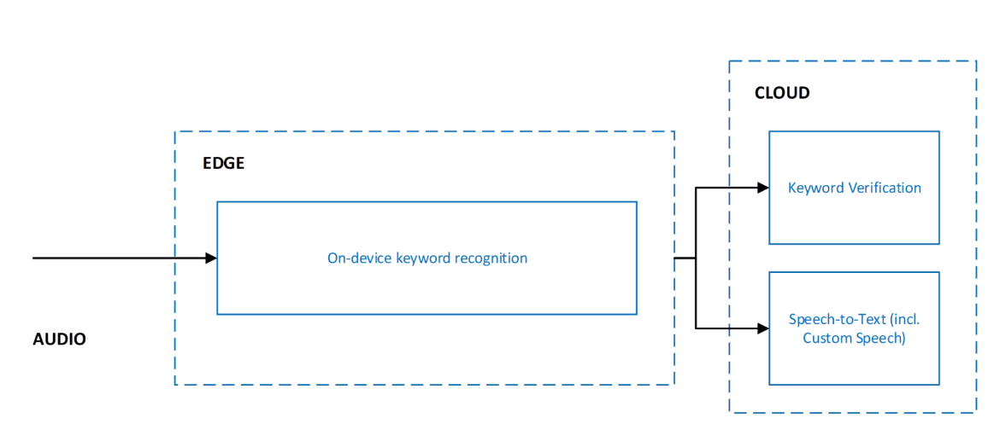

Continuos audio on .NET:

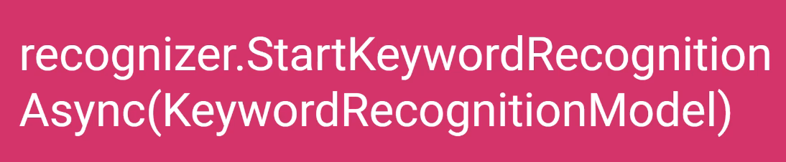

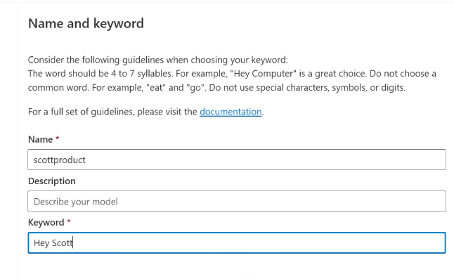

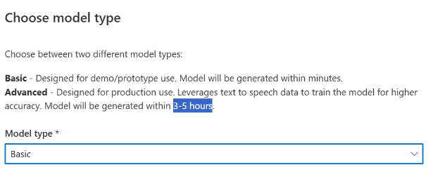
