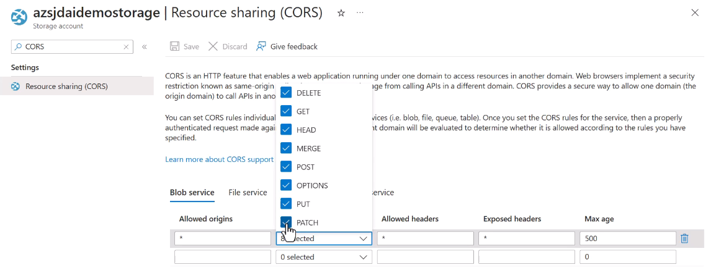

# Translate language

## Translate text and documents by suing the Azure AI translator service.

100-160+ languages and dialects.

Customizable translation -> technical words, keywords...

We can use:

- Synchronous translation.
- -Asynchronous translation.
- Real-time translation. Quite difficult.

## Create an AI Translator resource

## Azure AI Language Studio for translation

Careful with the limits.

**Glosary file** -> specific translation requirements.

## Implement custom translation

Parallel documents -> already translated documents used as training set. 10.000 sentences needed.

Dictionary data -> One text file for each language and translations line by line.

BLEU score (0-100). **From 40-60 is already high quality.** 60+ is very, very good.

## Translate speech-to-speech by using the Azure AI Speech Service

Behind the scenes, multiple resources being uised from one API call.

Using the Speech API.

Sort of real-time!

Another example with a file instead of microphone:

## Translate speech-to-text by using the Azure AI Speech Service

Easier than speech-to-speech (no speech synthesis).

## Translate to multiple languages simultaneously

Same in text-to-text (REST API):

