# Language Understanding Model using Azure AI Language

## Create intents and add utterances

**Utterance** -> what a user might say. Kind of an input to a chatbot.

**Intent** -> the task or action the user wants to perform.

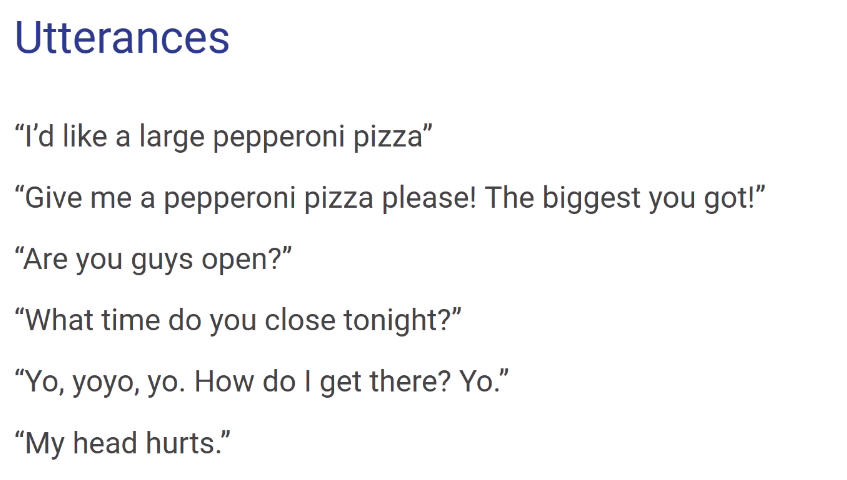

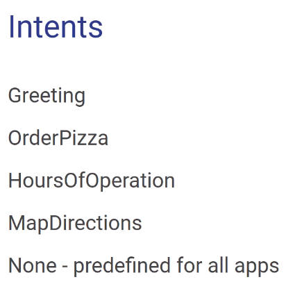

We will need to label utterances into intents. When they say somethiong their intention is X.

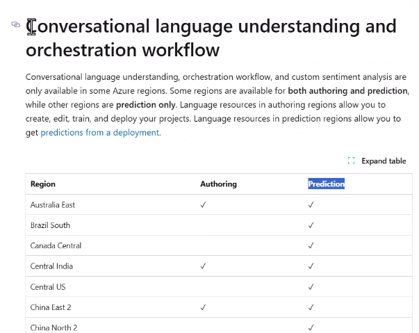

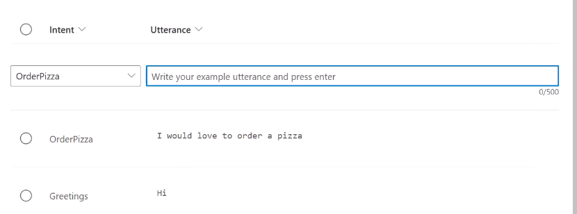

We can use OpenAI resource (generative AI) to create examples for utterances.

## Create entities

Entities -> key elements in an utterance that need to be extracted.

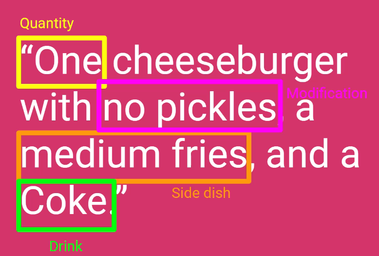

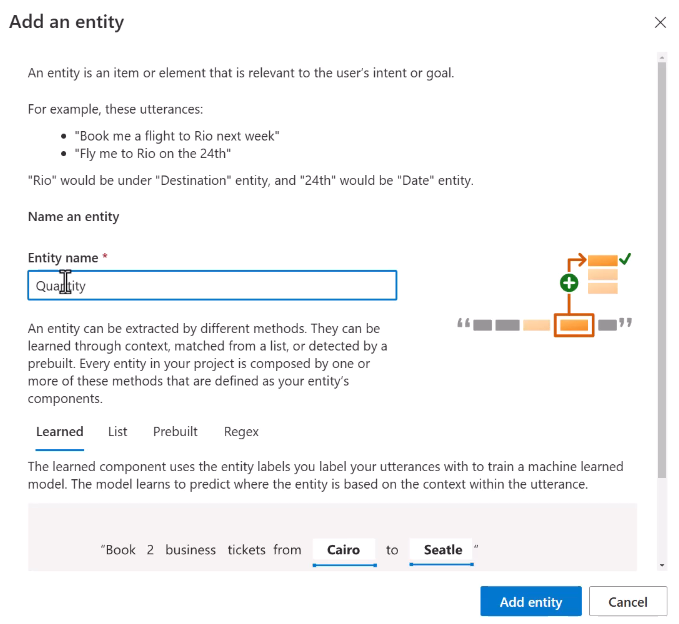

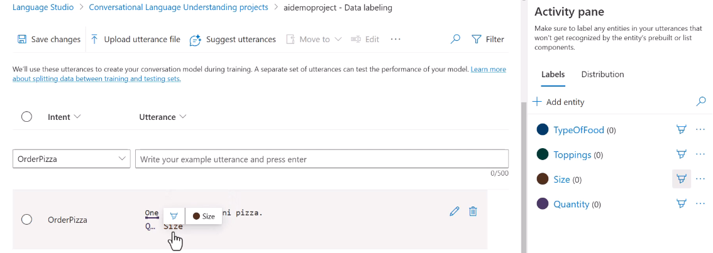

## Use ChatGPT to create Sample Utterances

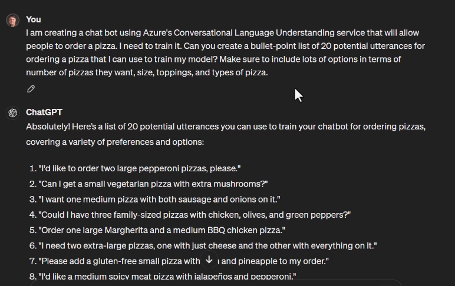

## Train and evaluate a conversation language understanding model

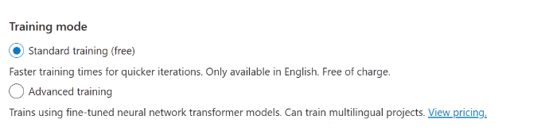

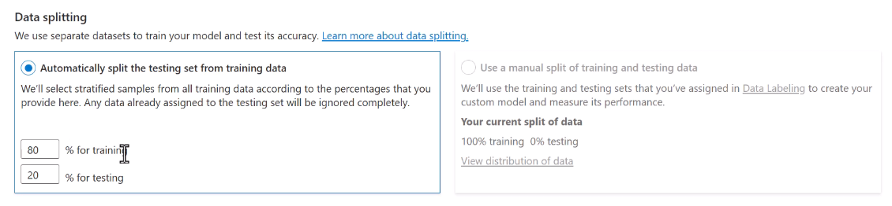

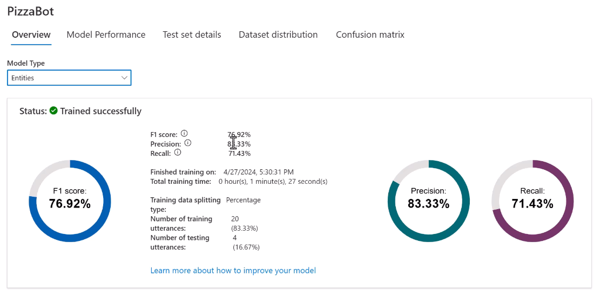

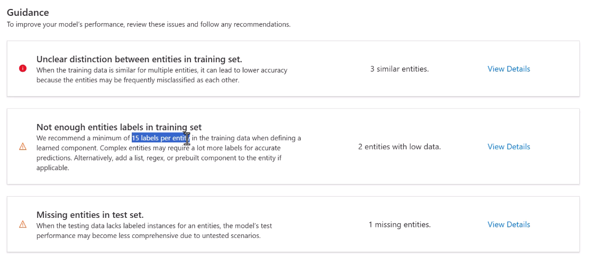

## Deploy and test a conversation language understanding

Confustion matrix

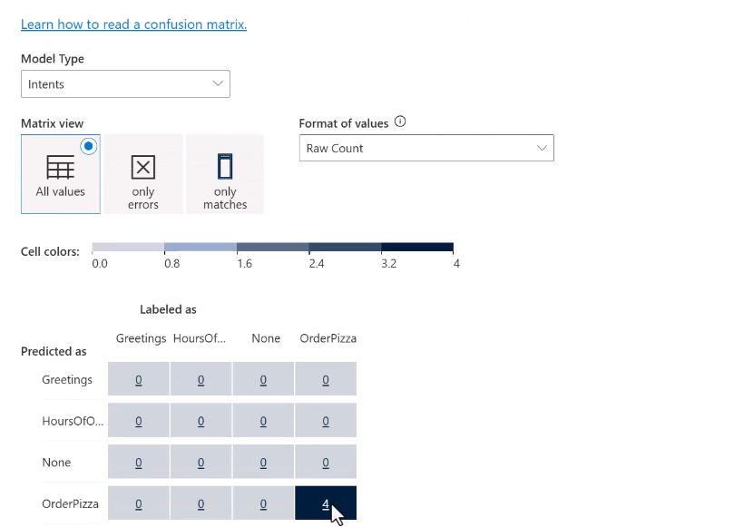

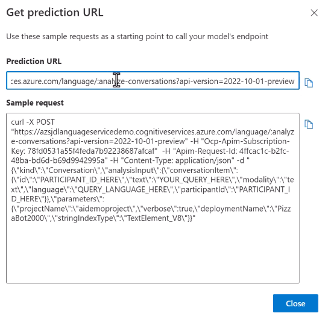

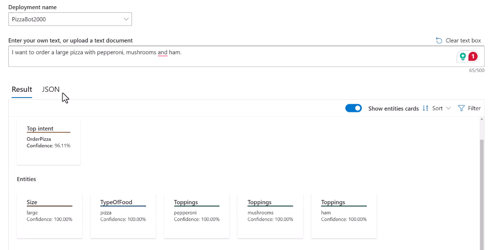

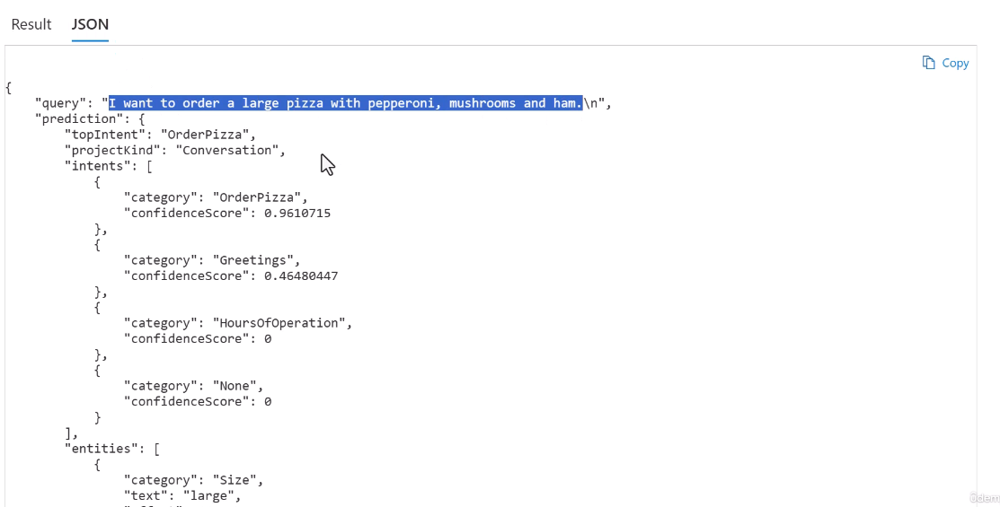

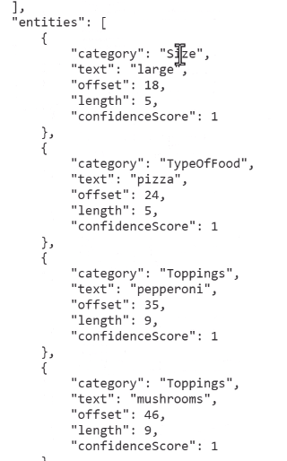

## Backup and recover language understanding models

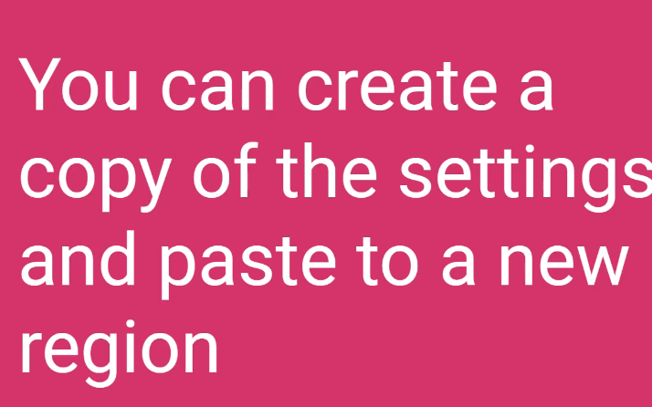

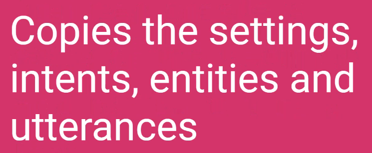

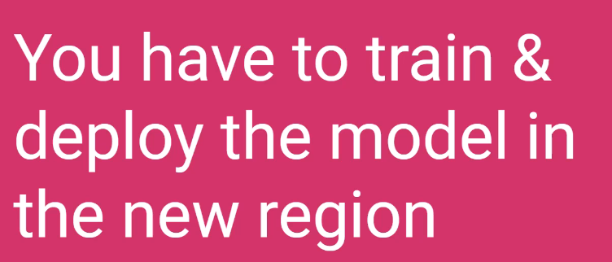

**You will need two Azure AI Language Services in two regions!**

And export through the REST API.
