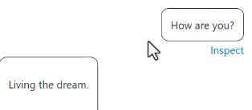
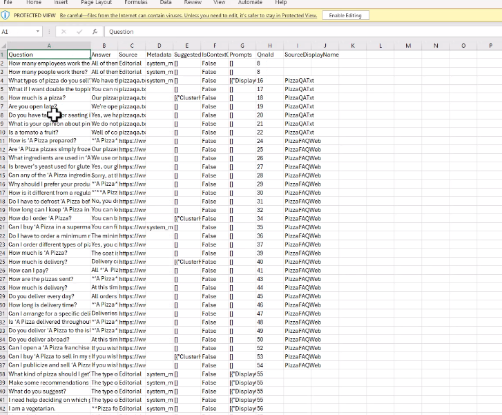

# Question answering solution by using Azure Ai Language

## Overview of QA

We can use the QA solution of overlap this service now with a trained OpenAI model.

When we have static information, this is the best question. **Static and having to return the same answer for the same question, always.** This is not Generative AI.

**Conversation flow** -> direct the conversation through certain paths. We can handle this with in-question answering, called **multi-turn conversation.**

## Create a QA

## Add question-and-answer pairs manually

## Import sources

Question in one line, then answer.

Also, we can read from the QA of a web page.

## Train and test a knowledge base

We have confidence score for each question/answer, based on the input!

With an unrealted question and a more realistic confidence score, we get a value of 0.0, and an id of -1.

We can also do weird questions that will not be detected as expected.

## Publish a knowledge base

Important, for the header:

## Create a multi-turn conversation

We can then add prompts for the vegetarian asking, for example, if the customer is vegan. Or other options!

## Add alternate phrasing

## Add chit-chat to a knowledge base

## Export a knowledge base

## Create a multi-language question answering solution

Has to enabled on project creation because of pricing. Even chit-chat supports multiple languages.

1. Create the QA knowledge base in one language.
2. Test, train, perfect.
3. Create a new project in a second language.
4. Test, train, perfect.
5. You will need to send users to the correct endpoint based on their language, **because we have a different endpoint for each one.**
   1. Also, we could perhaps use the Language Detection AI method to intercept the first question and determine the language.
