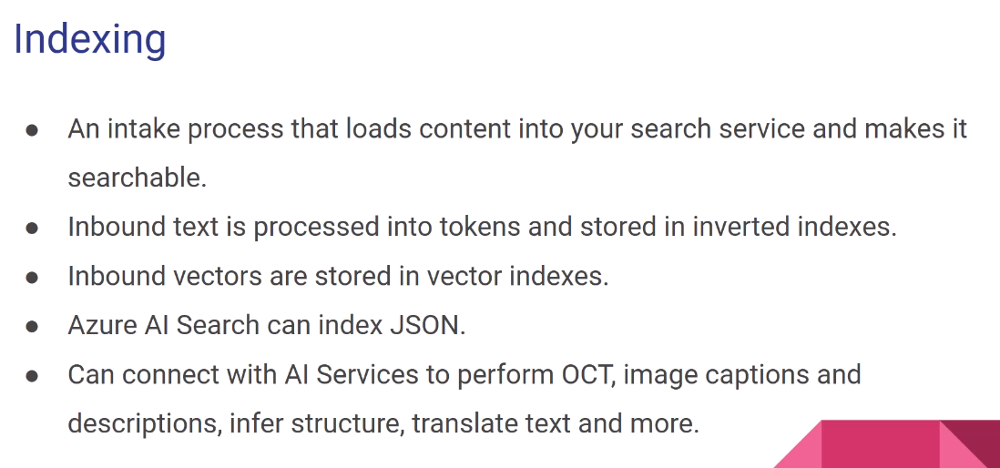
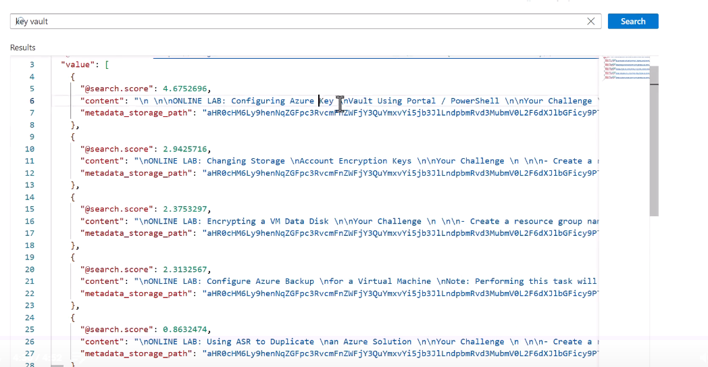

# Implement an Azure AI Search solution

## Overview of Azure AI Search

Used to be Cognitive Search.

It is basically information retrieval over user-owned content.

Traditional full text search and next-generation vector similarity search (vector data -> new AI models).

**It ingets heterogeneous (non structured) content. PDFs, images, audios, etc...**

We could get our data out of an Azure Blob Storage accopunt or Cosmos Db.

**Indexing** -> loads content from outside and makes it searchable (and maybe other characteristics such as sortable).

**Querying** -> asking for information to the index.

Semantic Ranking -> uses AI Language Understanding to return the results that are more semantic related.

## Provision an Azure AI Search resource

**For 99.9% availability in read and write we need at least 3 replicas.** Check the partitions/replicas documentation on Microsoft.

Basically, **replicas** are workloads (workers accepting queries) and **partitions** are divisions on the data in multiple servers, allowing for multiple searches at the same time. They work like a Matrix forming **Search Units.**

For read only 2 replicas.

For write (and read and write) we need 3 replicas.

## Create data sources

AI Search understands JSON file format. There are 100s of partners sources. Oracle, Jira, Google Drive, etc... They may have limitations.

## Azure AI Search Indexes

- **Retrievable** - it can be displayed in the search result.
- **Searchable** - fields that can contain keywords. Is what the Search Engine looks at to determine if it is a match or not.
- **Filterable** - reducing the number of results by criteria.
- **Sortable** - ability to be sorted.
- **Facetable** - drill downs, navigation. Topics, hash tables (more or less). Kind of a group by or count function.

## Create an index

merged_content field will have OCR to merging the content from the PDF plus from any images. Useful if we have embedded images on the PDF.

Other options for enrichments:

All ends up in a **Knowledge Store**:

The fields that will be created (including enrichments):

The indexer:

## Define a skillset

A skillset is an array of one or more skills that perform an enrichment, such as translating text or optical character recognition (OCR) on an image file. Skills can be the built-in skills from Microsoft, or custom skills for processing logic that you host externally. A skillset produces enriched documents that are either consumed during indexing or projected to a knowledge store.

**NEEDED FIELDS and other fields:**

**Skillset** - reusable resource attached to an indexer. Gets extra work done, providing even more information.

It is a collection of **skills**.

There are:

- **Built**-in skills.
- **Custom** skills. **WebAPI!**

- **Conditional** - The Conditional skill enables Azure AI Search scenarios that require a Boolean operation to determine the data to assign to an output. These scenarios include filtering, assigning a default value, and merging data based on a condition.
- **Document Extraction** - The Document Extraction skill extracts content from a file within the enrichment pipeline.
- **Text merge** - merges fields.
- **Shaper** - breaks up a field into multiple. Modifies the structure of the in-memory enrichment tree.
- **Split** - Breaks large chunks of text into smaller ones with a limit.

An **enriched document** is a temporary, tree-like data structure created during skillset execution that collects all of the changes introduced through skills. Collectively, enrichments are represented as a hierarchy of addressable nodes. Nodes also include any unenriched fields that are passed in verbatim from the external data source.

An enriched document exists for the duration of skillset execution, but can be cached or sent to a knowledge store.

Web API skill and AML are IMPORTANT for the exam.

## Implement custom skills

A Web API that the indexer calls to.

Receives JSON input and returns JSON output.

It has to be running in the same region as the indexer.

Azure Functions, Azure Web Apps, etc...

## Create an run an indexer

**Indexer** -> a job that runs once/hourly/daily/custom to check if there is any new content and create/update./delete the relavent information realted.

## Query an index, including syntax, sorting, filtering, and wildcards

(+) sign makes it mandatory.

(-) removes certain words.

IMPORTANT, we need:

- **endpoint** - The endpoint URL of the search service
- **indexName** - The name of the index
- **api-version** - ClientApi Version

