# Implement an Azure AI Document Intelligence solution

## Overview of AI Document Intelligence

Extract text, key-value pairs, tables, and structures from documents.

Turn documents into usable data. Especially PDFs.

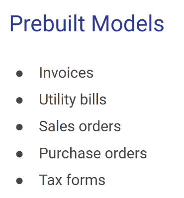

Mainly US centric.

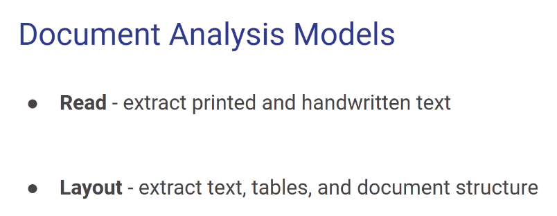

- **Neural model** - uses AI to extyract the data.
- **Template model** - more like an invoice with boxes and coordinates.
- **Composed model** - template+neural mixed.

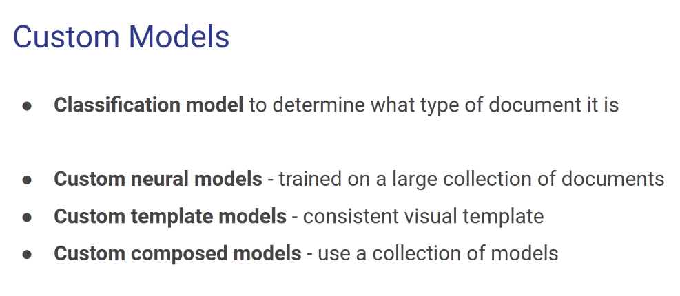

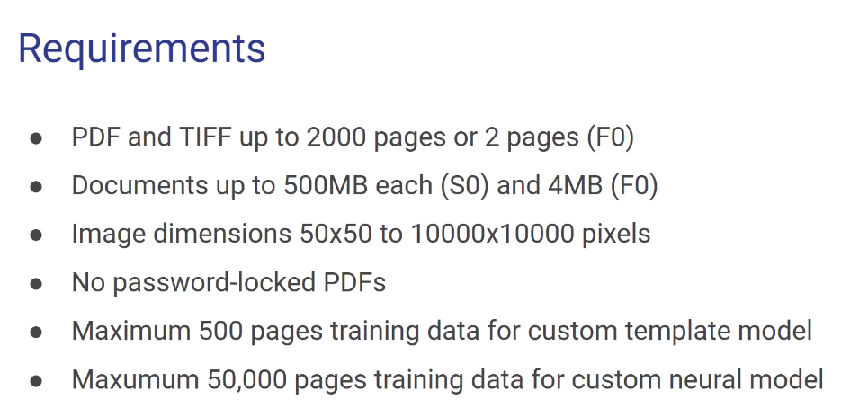

Important the maximum and the fact that it cannont have a password.

## Provision a Document Intelligence resource

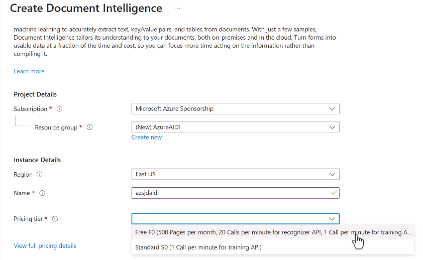

## Use prebuilt models to extract data from documents

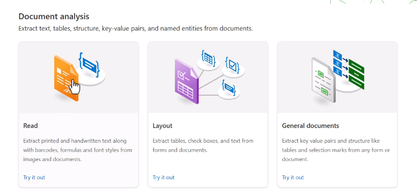

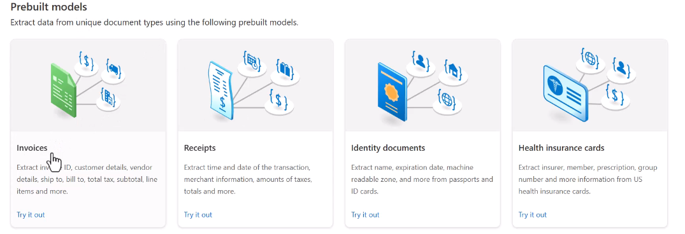

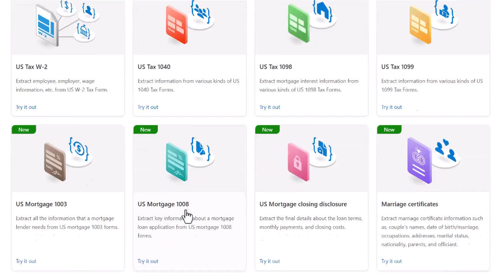

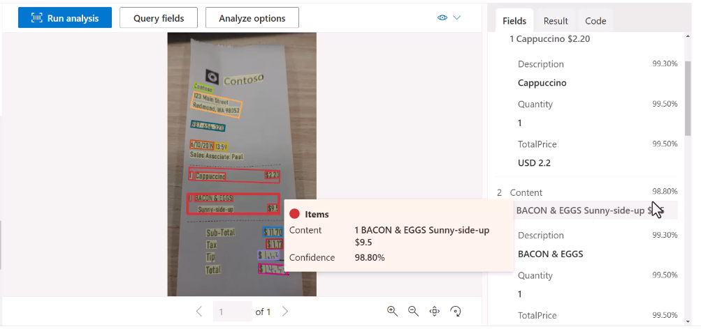

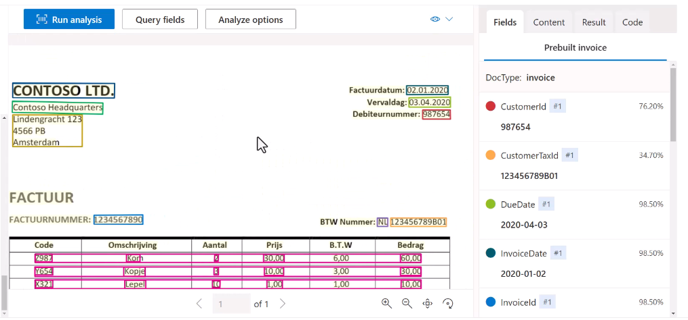

Because it knows it is looking at an invoice, it is only extracting the data and not the labels.

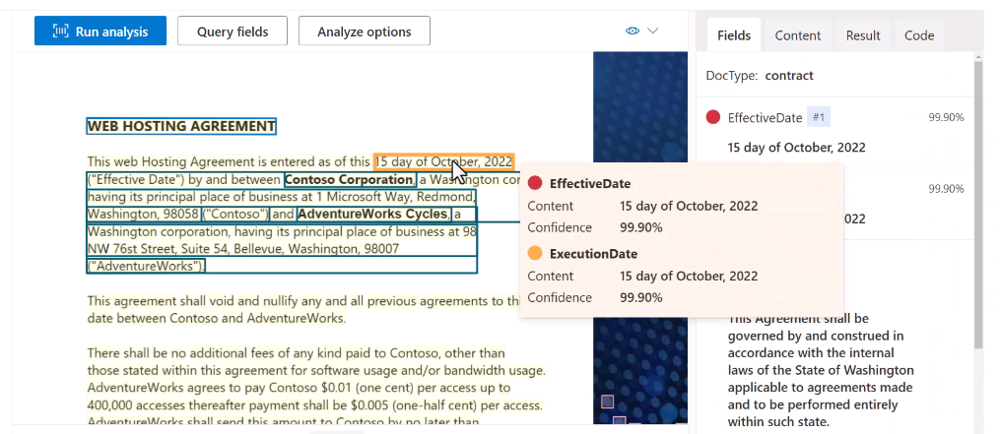
