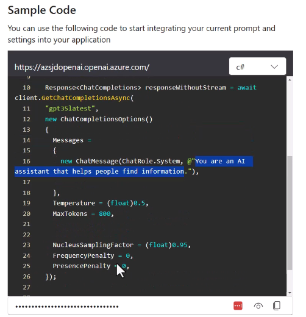

# Use Azure OpenAI Service to generate content

## Overview of Azure OpenAI Services

LLM - Computer generated text that is extremely human-sounding

Not guaranteed to be 100% accurate.

- **Multi-modal chats** - it allows for different kinds of inputs. Text, images, etc...
- **Prompt engineering** - Wording and definition of the input. Formatting.
- Retrieval Augmented Generation (RAG) - Provide extra information on the input to improve the output. For exampplem, adding definition for technical terms on the input.
- **Fine tuning** - Retraining LLM for improved and personal version.

## Provision an Azure OpenAI Service resource

## Select and deploy an Azure OpenAI model

**Your models updates automatically only once the version you are using is retired.**

## Submit prompts to generate natural language

**System message** - Setup for the chatbot to help with the behaviour.

## Submit prompts to generate code

## Use the DALL-E model to generate images

