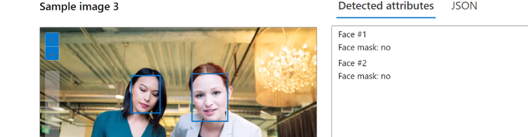

# Select the appropriate Azure AI Service

## Computer vision

Advanced alrithms that process images and return information based on the visual features you're interested in.

Some examples:

Dense captions

Face detection (a liveness detection is part of this resource to handle someone showing a piece of paper):

## Natural language processing solution

Azure AI Language Service unifies old services.

It is available as preconfigured or customizable.

Some examples and information:

- Key phrase extraction - extracts the main topics of a conversation
- Named Entity Recognition (NER) - detects the main entities (people, names, objects, brands) in a text/conversation.

## Speech services

## Generative AI solution

Types (in Open AI):

- Conversational
- Content creator
- Image generation (DALL-E)

Data grounding (RAG): feed the LLM with exact data (for example, a spreadsheet), the LLM behaves more like a Db that checks the spreadsheet directly.

## Document intelligence solution

Document analysis using prebuilt or custom models.

It even supports Contracts:

Now for the custom models:

Also classification!

## Knowledge mining

AI Search Services (Basically a Search Engine)

Combining the index and other services, you can build a **Knowledge Store.**

