# Plan, create and deploy an Azure AI service

## Responsible AI principles

## Create an Azure AI resource

We have the option between multi-service accounts and individual service accounts.

If we just want one resource, just choose the single resource.

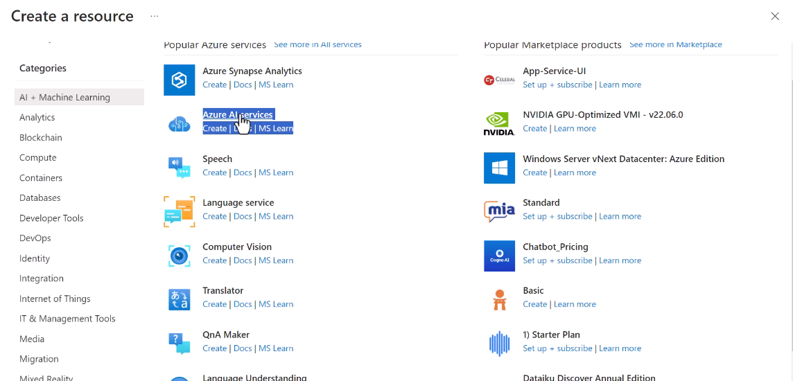

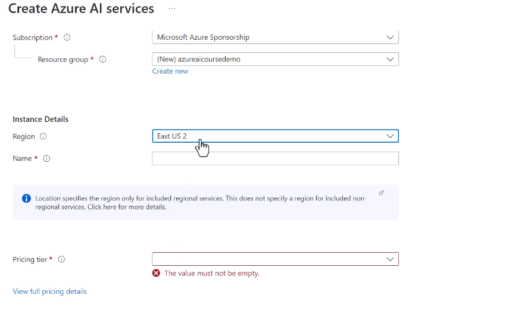

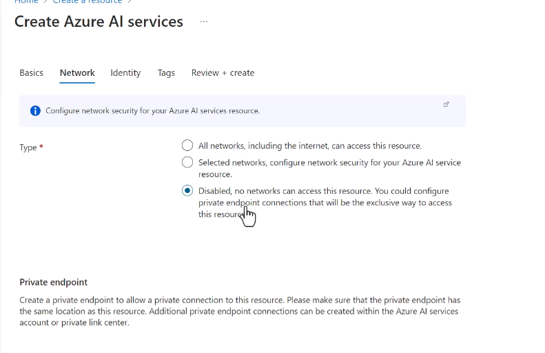

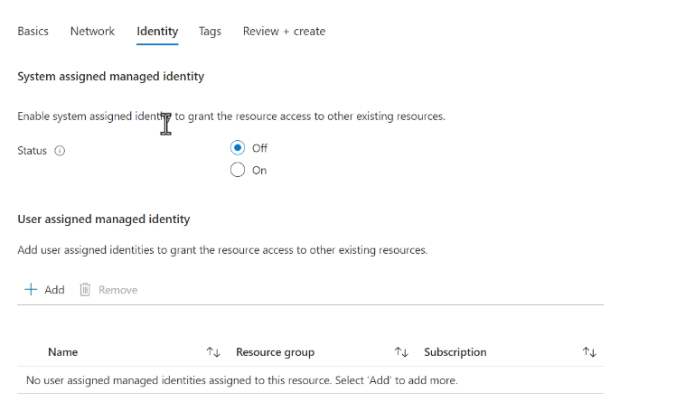

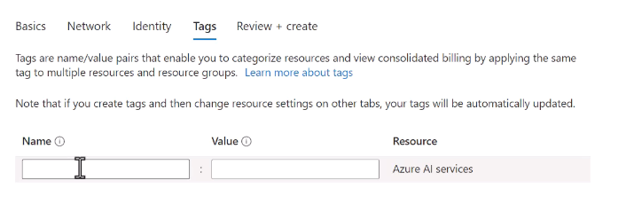

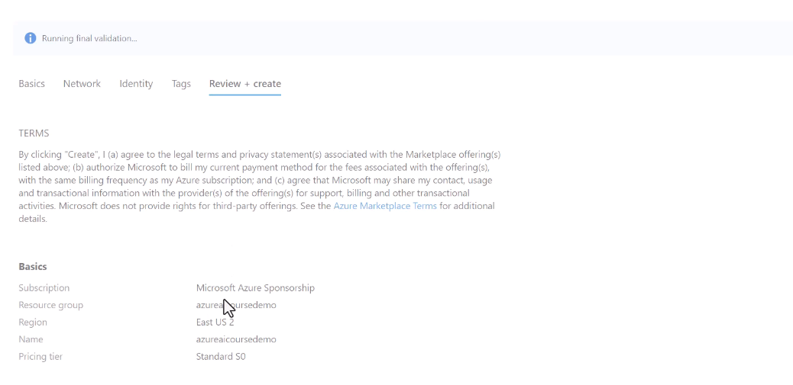

## Default endpoint for an Azure AI service

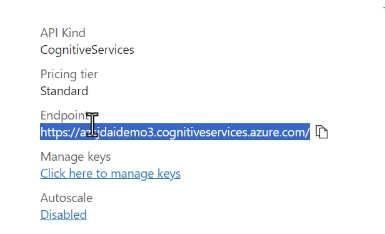

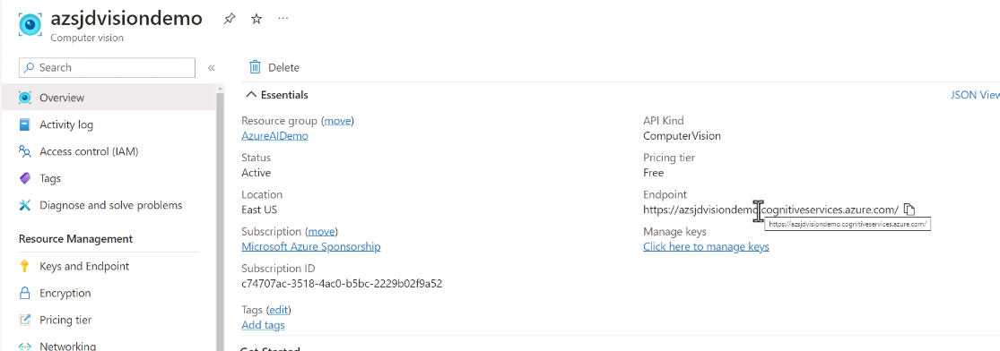

We also need to pass the Secret Keys with the endpoint. The idea of having two keys if in case of compromising one of them, regenerate it and meanwhile use the other.

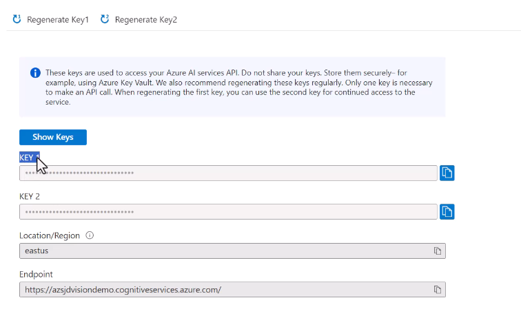

## Azure AI CI/CD

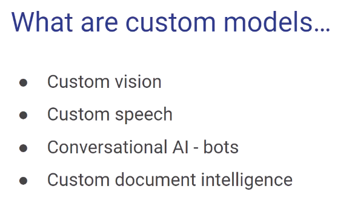

If the new model does not improve on the old error rate, stop. If it does, deploy and replace the old one!

## Azure AI Services container deployment

You may not want to operate in the cloud for compliance, security or performance concerns.

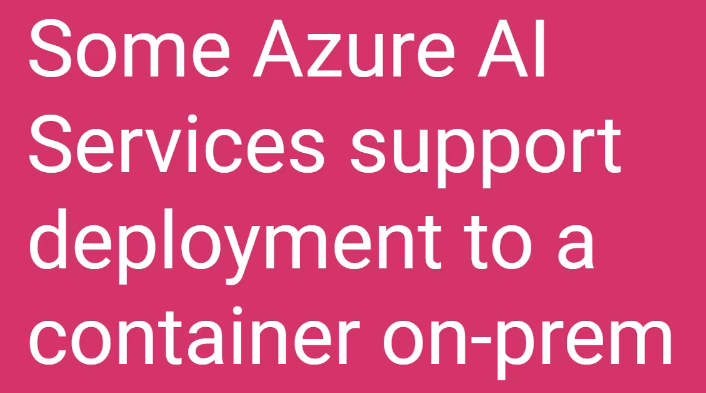

**We can deploy SOME services On-Prem with containers. Also, some containers support offline use.**You need to ask permission to Microsoft for this.

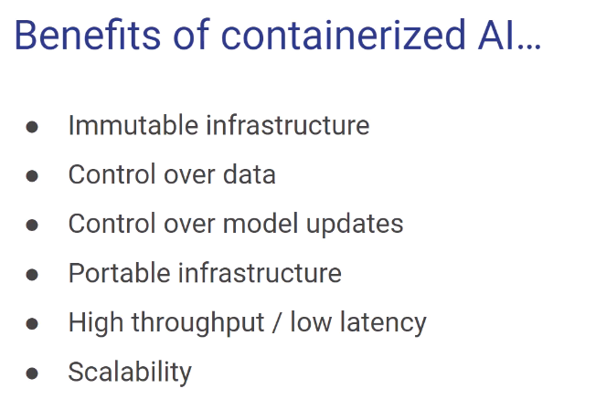

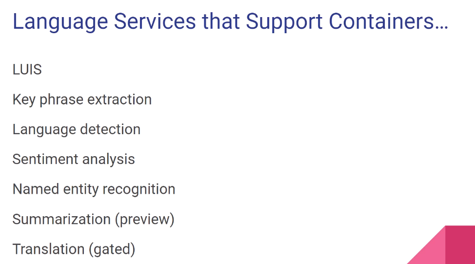

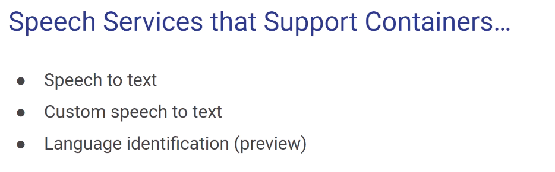

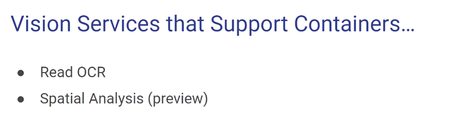
