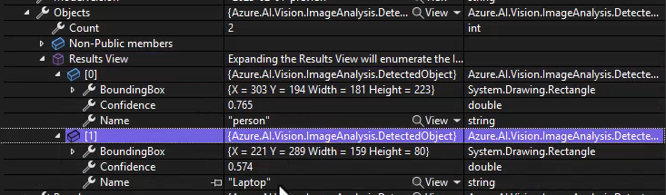

# Analyze images

## Azure AI Vision Services Overview

Important the threshold (confidence) value.

## Select visual features to meet image processing requirements

## Detect objects in images and generate image tags

**Tags (labels)**-> context of the image, themes. Slightly generic, thematic.

With just one API call you can potentially get back all of this elements.

**Objects** -> they are phisical, identifiable and located. It is the identification of what the model sees.

## AI Vision Services Pricing

Select the features you actually need.

## Interpret image processing responses

In crop suggestions, we get both the AspectRatio and BoundingBox.

## Extract text from images using Azure AI Vision

**It can handle 160+ languages of text. It can only handle around 13 if the text is handwritten.**
