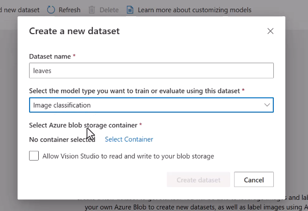

# Implement custom computer vision models

## Choose between image classification and object detection models

## Label images

**We can create either or both labels. Also, heriarchies!**

Remember that some projects could be multilabeled.

## Train a custom image model

We need a test dataset.

## Create and label a test dataset in Azure ML

## Evaluate custom vision model metrics

**With 3/5 right answers, precision would be 60%.**

**Accuracy** in the other hand:

Also, when talking about **recall (how many were supposed to be identified)** precision more or less merges qith accuracy in the exam questions.

## Publish a custom vision model

## Consume a custom vision model

