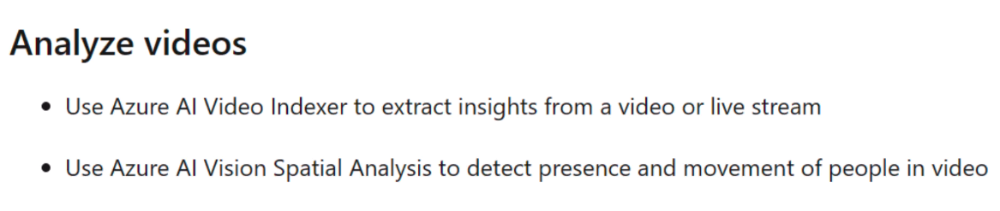

# Analyze videos

## Use Azure AI Video Indexer to extract insights

## Use Azure AI Vision Spatial Analysis to detect presence and movement

Also, entrance counting. In the following example, how much time people expend waiting in line:

Social distancing and face mask:

