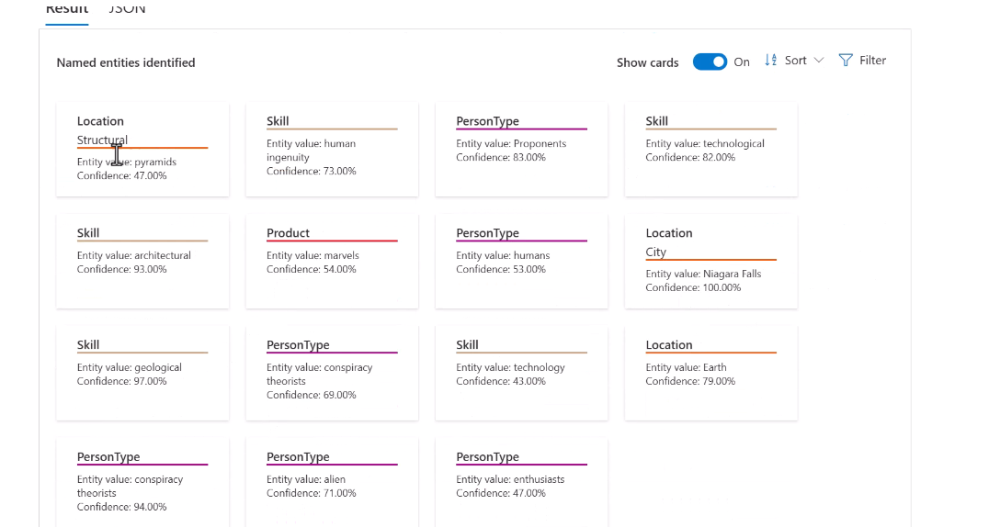

# Analyze text by using Azure Ai Language

## Extract key phrases

Options:

Supports multiple input languages.

Performs better the more text you give.

REST API endpoint:

C#

## Extract entities

**Entities are essentialy real/physical things.**

We have a confidence on the classification.

## Determine sentiment of text

**Between positive, negative or neutral.** If we pass 10 sentences and 1 is positive and 9 are neutral, the bulk (the whole document) will get identified as **SLIGHLTY positive!**

Can be customized. Very/slightly positive, etc... We can also train it for salng (dope).

With target of the assesment:

## Detect the language used in text

Around 160!

Also, multiple scripts. Remember transliteration option.

Importance on the iso identifier.

## Detect personally identifiable information (PII) in text

