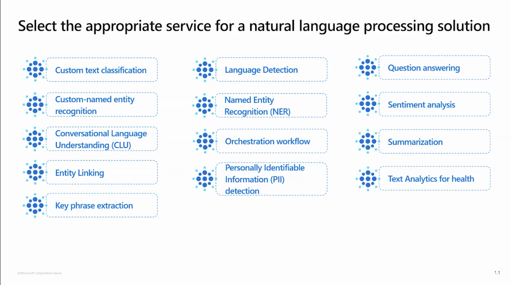

# Preparing for AI-102 - Summary of all 6 videos

## Links

Preparing for AI-102 - Plan and manage an Azure AI solution (Part 1 of 6)
<https://learn.microsoft.com/en-us/shows/exam-readiness-zone/preparing-for-ai-102-plan-and-manage-an-azure-ai-solution>
Preparing for AI-102 - Implement decision-support solutions (Part 2 of 6)
<https://learn.microsoft.com/en-us/shows/exam-readiness-zone/preparing-for-ai-102-implement-decision-support-solutions>
Preparing for AI-102 - Implement Azure AI vision solutions (Part 3 of 6)
<https://learn.microsoft.com/en-us/shows/exam-readiness-zone/preparing-for-ai-102-implement-azure-ai-vision-solutions>
Preparing for AI-102 - Implement natural language processing solutions (Part 4 of 6)
<https://learn.microsoft.com/en-us/shows/exam-readiness-zone/preparing-for-ai-102-implement-natural-language-processing-solutions>
Preparing for AI-102 - Implement knowledge mining and document intelligence solutions (Part 5 of 6)
<https://learn.microsoft.com/en-us/shows/exam-readiness-zone/preparing-for-ai-102-implement-knowledge-mining-and-document-intelligence-solutions>
Preparing for AI-102 - Implement generative AI solutions (Part 6 of 6)
<https://learn.microsoft.com/en-us/shows/exam-readiness-zone/preparing-for-ai-102-implement-generative-ai-solutions>

## Tips

You  should expect more questions about the "Implement natural language processing solutions" because it is 30-35% of the exam.

### Plan and manage an Azure AI solution

1. Select the appropriate Azure AI service
2. Plan, create, and deploy an Azure AI service
3. Manage, monitor, and secure an Azure AI service

The following is crucial:

### Implement decision-support solutions

1. Create decision-support solutions for data monitoring and content delivery

At most 10.000 intervals forward counting from the most recent timestamp

### Implement Azure AI vision solutions

1. Analyze images
2. Implement custom Azure AI vision models by using Azure AI vision
3. Analyze videos

For a custom vision model, we will need to create a new project and choose between classification and model detection. We can then choose tags, domains, etc...

We should know the difference between image analysis, image retrieval and background removal.

For OCR, we can use two methods:

About labeling, remember that we need to use bounding boxes. Some tips are to use clear and consistent tags, use high quality and vaired images, and review the labels.

About training:

And evaluation:

The keyowrd for recall is actual classification. mAP is mean Average Precision!

It can help us identify spoken words, written text, faces, topics, etc...

### Implement natural language processing solutions

1. Anallyze text by using Azure AI Language
2. Process speech by suing Azure AI Speech
3. Translate language
4. Implement and manage a language understanding model by using Azure AI language
5. Create a question-answering solution by using Azure Ai language

An entity is a specific object or concept that can be identified in the text. It is not the same as a key phrase.

We have separated endpoints for entity linking, and you c an get information from multiple sources (like Wikipedia)

This gives us the CODE of the language (if it is spanish, english, etc...). It can detect the largest language represented if there are multiple in the document.

About text-to-speech

SSML is based on XML.

Import to differentiate between Text TRanslation and Document Translation.

Transliterate -> English to Japanese (hiragana/katakana). Not the same as translation.

This one is important:

### Implement knowledge mining and document intelligence solutions

1. Implement an Azure AI Search solution
2. Implement an Azure AU Document Intelligence solution

This one is important:

### Implement generative AI solutions

1. Use Azure OpenAI Service to generate content
2. Optimize generative AI

