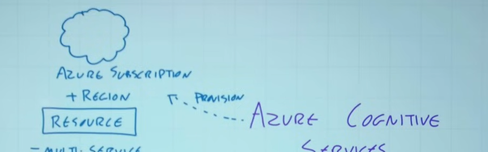
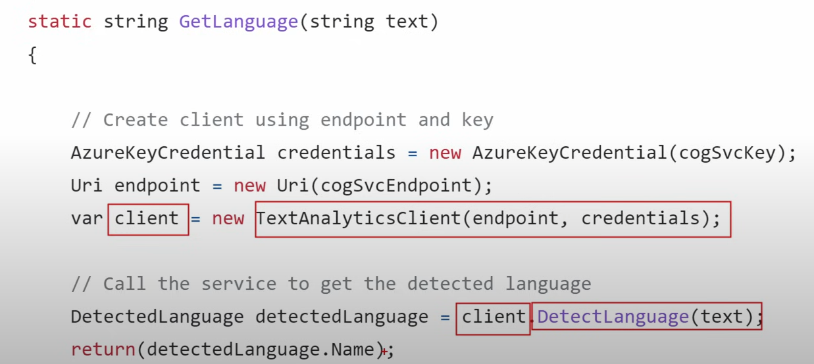
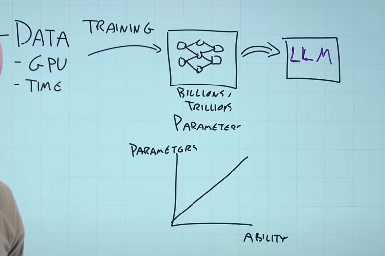

# AI-102 Study Cram - Azure AI Engineer Associate Certification

<https://www.youtube.com/watch?v=I7fdWafTcPY>

<https://www.youtube.com/watch?v=Ch6KE7KxHGM>

- [AI-102 Study Cram - Azure AI Engineer Associate Certification](#ai-102-study-cram---azure-ai-engineer-associate-certification)
  - [Responsible AI](#responsible-ai)
  - [What is AI](#what-is-ai)
  - [Azure ML](#azure-ml)
  - [Azure Cognitive Services](#azure-cognitive-services)
  - [Deploy to Azure](#deploy-to-azure)
    - [REST API and SDK](#rest-api-and-sdk)
      - [REST](#rest)
      - [SDK](#sdk)
    - [Pricing](#pricing)
    - [Deploying to containers](#deploying-to-containers)
  - [Visual perception services](#visual-perception-services)
    - [Image analysis](#image-analysis)
    - [Video analysis](#video-analysis)
    - [Image classification](#image-classification)
    - [Object Detection](#object-detection)
    - [Face service](#face-service)
    - [OCR](#ocr)
  - [Language understanding](#language-understanding)
    - [Question answering (old QA, now more related to OpenAI it seems)](#question-answering-old-qa-now-more-related-to-openai-it-seems)
    - [Text analysis](#text-analysis)
    - [Translation](#translation)
  - [Speech](#speech)
    - [Speech to text](#speech-to-text)
    - [TextToSpeech](#texttospeech)
    - [Speech translation](#speech-translation)
    - [Speaker recognition](#speaker-recognition)
  - [Decision making](#decision-making)
    - [Anomaly detection](#anomaly-detection)
    - [Content moderation](#content-moderation)
    - [Content personalization](#content-personalization)
  - [Pre-built solutions](#pre-built-solutions)
    - [Document intelligence(named changed, it used to be Forms Recognizer)](#document-intelligencenamed-changed-it-used-to-be-forms-recognizer)
    - [Metrics advisor](#metrics-advisor)
    - [Video Analyzer for media](#video-analyzer-for-media)
    - [Immersive reader](#immersive-reader)
    - [Bot service (now more related to OpenAI)](#bot-service-now-more-related-to-openai)
    - [Cognitive Search](#cognitive-search)
      - [Enrichment](#enrichment)
  - [OpenAI](#openai)
    - [Training](#training)
    - [Abilities](#abilities)
    - [Tokens, dimension, vector](#tokens-dimension-vector)
    - [Attention](#attention)
    - [OpenAI GPT](#openai-gpt)
    - [Copilot](#copilot)
    - [Prompt engineering](#prompt-engineering)
    - [Azure OpenAI](#azure-openai)
    - [Azure OpenAI Studio](#azure-openai-studio)
    - [Responsible](#responsible)

## Responsible AI

- Fairness: no bias on gender, race, etc...
- Reliability and safety: the more we use this systems, the more they need to perform in a reliable and safely manner.
- Privacy and security: the models are trained in huge amounts of data, but we need to ensure that things like private data should be kept private.
- Inclusiveness: all system should empower everyone.
- Transparency: we should understand how it is working, and its limitations.
- Accountability: accountable for the AI systems. Governance and principles in place.

## What is AI

- Human like - capabilities
  - Visual perception
  - Language
  - Speech (both hearing and speaking)
  - Decision making. Inference, prediction, etc...

AI is built on top off ML, which is all data and algorithms. We use this data to train prediction models.

And ML is built on top of Data Science, which is mainly math and statistics.

## Azure ML

## Azure Cognitive Services

- Visual perception
  - Image analysis
  - Video analysis
  - Image classification
  - Object detection
  - Facial analysis
  - OCR
- Language
  - Language understanding
    - Question-answering
    - Text analysis
  - Translation
- Speech
  - Speech-To-Text
  - Text-to-Speech
  - Speech translation
  - Speaker recognition
- Decision making
  - Anomaly detection
  - Content moderation
  - Content personalization

Microsoft has a lot of pre-built options.

- Forms recognizer
- Metrics advisor
- Video analyzer for media
- Immersive reader
- Bot service -> conversational interaction
- Cognitive search

## Deploy to Azure

A resource can be:

- Multi-service: single endpoint + access credentials but crossed
- Single service: only one resource. Training may require different resources.

The most important parts are:

- Region
- Endpoint URI. It can have its own firewall, so we can restrict it to:
  - Public Ips
  - Service endpoints
  - Private endpoints (disables the public one by default)
- 2 keys. You can rotate them for security purposes.

We can have an Azure Key Vault that hides certain keys from certain services or people.

### REST API and SDK

#### REST

If we have the endpoint URI and the key, we can interact with the right services.

Using REST, we can create PUT, POST, GET, etc. request using HHTP JSON, and we will get a response in the exact same way (JSON).

#### SDK

Abstracts the REST api.

### Pricing

Consumption based.

We have alerts and metrics. The alerts can be based on the metrics, costs, etc...

There are logs for audit, request, response, trace... These are called diagnostic settings. We can send it to LAW, Event Hub and other Azure apps, or our permanent storage.

### Deploying to containers

In the dockerfile:

## Visual perception services

### Image analysis

It gives you a description of the image. May also categoruize it, give it tags (car, sun), detection, etc. Also check for rting on violence, cross the information with other Db (ours or from Microsoft).

### Video analysis

Similar. Also we have facial recognitiion, OCR, speech (transcription of the dialog), identify key topics, sentiment, label, content moderation, scene segmentation.

Also we havbe custom insights, for example, specific terminology from an industry.

### Image classification

With labelled images, we can train a model that then will be able to tag images with the right label.

We can have multi-label images.

As it is a prediction, we can use multiple resources, one for the training and other for the prediction. Also using the SDK and API.

### Object Detection

Phisically locates an object with a bounding rectangle.

### Face service

Important privacy, transparency on use, and inclussive.

Age and gender have been removed!

The face service goes further than image analysis. Information like nose, eyes, objects (glasses), where everything is, detection and verification.

All the detection and verification will get an ID for 24 hours, for validation scenarios.

At last, we have recognition. It can be trained to identify certain people faces, multiple poses, etc...

### OCR

- Read API.
  - Images, PDF
  - Small or large (entire volumes)

- Image Analysis API
  - For smaller amounts of text. Synchronous call. Mainly categorization.

## Language understanding

There is the idea of:

- Learned
  - Intent -> utterances
    - The intent could be time, and the utterances questions like what is the time
    - Also related to an entity. For example, what is the time in LONDON.
    - There a lot of prebuilt (ips, names, emails, dates, etc...)
    - 
  - Custom Named Entities
    - Data and labels as JSON. Just adds more information personalized for our use case.
  - Custom text classification:
    - Single label: L1, L2, L3...
    - Multi-label: for a piece of text, you can assign multiple labels.
- Preconfigured
  - Summarization
  - PII detection

Two things to remeber:

- **Recall**: of the actual labels, how many were identified.
  - Ratio of true positives to everything labelled.
  - 
- Precision: accuracy on the response.
  - 

**Recall is how many of what should have responded. Precision is the accuracy on the response that you actually got.**

### Question answering (old QA, now more related to OpenAI it seems)

We create a knowledge base. It comes from multiples places:

- FAQ
- Files
- Chats
- etc.

There will be Natural Language going in and a JSON response with the answer with a confidence score and maybe some other values.

There could be a whole list of interactions (follow-up)

### Text analysis

Options:

- Language detection: what language is this
- Key phrase extraction: returns key points from a piece of text
- Sentiment analysis: positivity/megativity of the text.
- Named Entity Recognition: people's names, cars, brands, etc... We can train it!
- Entity linking: helps dissambiguate. For example, link certain points of the text with a Wikipedia article.

### Translation

- Language detection (again)
- One-to-many translation: we can use the Read API to read multiple books and translate everythinmg into other languages.
- Transliteration: from native to alternative. Converts between alphabets, specific terminiology from idustries, etc...

## Speech

### Speech to text

There is a Speech To Text API and a short audio API for audio up to 60 seconds.

- SpeechConfig
  - Location
  - Key
- AudioConfig (optional)
  - It can override the default input

These two will create a **SpeechRecognizer** object.

It will then return multiple information like duration, the text, etc...

### TextToSpeech

There are two APIs again. The normal one and another for long text (whole books) to generate really long audios.

- AudioFormat
- Voices
- Return
  - It can go to the speakers, a file...

We will get a **SpeechSynthesizer** as an object.

We can feed both text and SSML.

SSML is Speech Synthesis Markup Language, so we can have speaking styles, pauses, pronunciation, voices, etc... It allows a richer output audio.

### Speech translation

The important column is the Langauge Code. There are variants (pt, zh, etc...)

We specify this as part of a Speech Translation Configuration.

We would get the original language text and the translated text.

We can also synthesize translation (the previous service).

- Event-based: if it is 1:1 translation between languages
- Manual: if we want to translate to multiple languages, so 1:n.

### Speaker recognition

We can identify inididual speakers.
Also intent recognition, where we can understand the semantics, mood, etc... of the spoken input.

## Decision making

### Anomaly detection

It can be one-signal or multi-signal. Maybe it needs to understand multiple signals with "unexpected" behaviour to activate.

### Content moderation

Both images and text.

- Images
  - Sexually explicit.
  - Mature in certain situations
  - Profanity
- Text
  - Sexually suggestive, explicit
  - Personal data (email, address, etc)

### Content personalization

Best decision, suggestions. For example, from media rankings.

## Pre-built solutions

### Document intelligence(named changed, it used to be Forms Recognizer)

JPEG, PNG, PDF, TIFF -> 500MB max

It returns a JSON with the text, bounding boxes, etc...

**We call the Analyze function which returns a ResultID. We can then get the ResultID for the actual result.**

We can also create a custom model. We would need a whole set of training data (forms).

- We can use the Forms Recognizer to speed up the process.
- Or have sample data in a blob container (Azure Storage) with corresponding files.
- So for every document there would be:
  - OCR file
  - Label file
  - Fields file

**We use all those files, in JSON format, to then train the model.**

### Metrics advisor

Data monitoring, similar to anomaly detection. We can train and modify the alerts.

### Video Analyzer for media

Using the visual services, but now a complete service. Scene segmentation, content labelling, face detection, speech recognition, etc...

### Immersive reader

- Easier to read. Isolating text.
- 
- Display pictures.
- 
- Highlight parts of text.
- 
- Read, translate, split words into syllables, etc...

### Bot service (now more related to OpenAI)

Maintain state in a multi-turn type dialog. We can communicate with multiple inputs (text, images, etc.) and multiple channels (chat, teams, etc.).

- Azure Bot Service
- Bot Framework Service (REST)
- Bot Framework SDK (call the Service)

We can override event methods to handle different types of activities.

Turn conext, dialogs with stateful multi-turns.

**We will have a recognizer to interpret the users input. A trigger to respond to the intended intent. And a language generator to formulate the output.**

We can even run it locally.

### Cognitive Search

Extract information from tons of data and make it available in multiple ways.

Indexing and querying a huge range of data (and sources). It can be multilanguage.

Some sources cannot handle arrays (like Azure Data Factory).

We can then use cogninite skills to ENRICH this data. We can combine this service with the others to just expand the data in a way that may interest us.

There are multiple tiers, based on cost.

For the index, we need to:

- Store it.
- interact with it.

We now have replicas, partitions and search units.

- Replicas: copies of the total index
- Partitions: parts of the index
- Search Units = Replicas * Partitions. **Max of 36 Search Units.**

#### Enrichment

Comes from a skillset. We can project it into a Knowledge Store to maintain this enrichment work into something with state.

About the Knowledge Store:

- If it was objects (input of the index) -> JSON
- Relational schema Db -> Table
- Unstructured like an image -> file

We can create custom skills. For example, querying to WebAPISkill to points to some URI of custom skill.

If we want return, we can mark everything as retrievable. We can keep it as suggestions on the web, etc...

We can boost results, query certain data, filtering, sorting, general search, etc...

## OpenAI

- AI: imitate some human behaviour
- Generative AI: switgches the focus to the creation of "original" content
  - Natural language
  - Images, videos
  - Code

LLM: Large Language Model. We use Natural Language to interact with it (prompts). Then divides it by tokens, predicts words and that is the response. This is called inference.

### Training

### Abilities

- Summarize text.
- Generate new text/images...
- Compare text

Its not AGI, it just predicts.

On the decoder it generates an output and brings it it once again to keep "understanding" and basically predicting.

### Tokens, dimension, vector

Two similar sentences will have a similar vector. **The vector represents a semantic meaning.**Output in Azure of the vector generated:

We have positional ending top differentiate when the phrases are similar but with completely different meaning.

### Attention

### OpenAI GPT

### Copilot

Multiple alternatives (APIs, Copilot, etc...) in Microsoft.

**The "Copilot" acts like an intermediary between the user, the LLMs and the Data/APIs.**

### Prompt engineering

The quaility of the prompt will drive the quality of the response. Explicit, behaviour, how to respond, formatting.

Grounding: bring outside data. For example, summarize a meeting (share the meeting) or an email (put the email in the prompt).

### Azure OpenAI

Supports GPT, embedding models and DALL-E.

We have the Azure OpenAI Studio.

We deploy an instance of a model. Then there is a playground of a studio and the we can use an API to use it.

### Azure OpenAI Studio

### Responsible

- Identify potential problems
- Measure of the potential harms
- Mitigate, protect this from happening
- Operate

